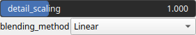

MixNormalMap Node
=================

TODO

## Category

Texture
## Inputs

|Name|Type|Description|
| :--- | :--- | :--- |
|normal map base|VirtualTexture|TODO|
|normal map detail|VirtualTexture|TODO|

## Outputs

|Name|Type|Description|
| :--- | :--- | :--- |
|normal map|VirtualTexture|TODO|

## Parameters

|Name|Type|Description|
| :--- | :--- | :--- |
|blending_method|Enumeration|TODO|
|detail_scaling|Float|TODO|

## Example

Corresponding Hesiod file: [MixNormalMap.hsd](../../examples/MixNormalMap.hsd). Use [Ctrl+I] in the node editor to import a hsd file within your current project.

!!! note
    Example files are kept up-to-date with the latest version of [Hesiod](https://github.com/otto-link/Hesiod).
    If you find an error, please [open an issue](https://github.com/otto-link/Hesiod/issues).

