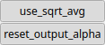

MixTexture Node
===============

MixTexture enables the seamless integration of multiple textures by utilizing the alpha channel information to control the blending.

# Category

Texture
# Inputs

|Name|Type|Description|
| :--- | :--- | :--- |
|texture1|HeightmapRGBA|Input texture.|
|texture2|HeightmapRGBA|Input texture.|
|texture3|HeightmapRGBA|Input texture.|
|texture4|HeightmapRGBA|Input texture.|

# Outputs

|Name|Type|Description|
| :--- | :--- | :--- |
|texture|HeightmapRGBA|Output texture.|

# Parameters

|Name|Type|Description|
| :--- | :--- | :--- |
|reset_output_alpha|Bool|Reset the output alpha channel to 1 (opaque).|
|use_sqrt_avg|Bool|Use square averaging for alpha-compositing (instead of linear averaging).|

# Example

No example available.