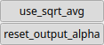

MixTexture Node
===============

MixTexture enables the seamless integration of multiple textures by utilizing the alpha channel information to control the blending.

## Category

Texture
## Inputs

|Name|Type|Description|
| :--- | :--- | :--- |
|texture1|VirtualTexture|Input texture.|
|texture2|VirtualTexture|Input texture.|
|texture3|VirtualTexture|Input texture.|
|texture4|VirtualTexture|Input texture.|

## Outputs

|Name|Type|Description|
| :--- | :--- | :--- |
|texture|VirtualTexture|Output texture.|

## Parameters

|Name|Type|Description|
| :--- | :--- | :--- |
|mix_method|Enumeration|No description|
|reset_output_alpha|Bool|Reset the output alpha channel to 1 (opaque).|

## Example

Corresponding Hesiod file: [MixTexture.hsd](../../examples/MixTexture.hsd). Use [Ctrl+I] in the node editor to import a hsd file within your current project.

!!! note
    Example files are kept up-to-date with the latest version of [Hesiod](https://github.com/otto-link/Hesiod).
    If you find an error, please [open an issue](https://github.com/otto-link/Hesiod/issues).

