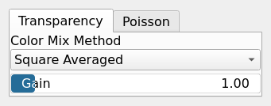

MixTextureMasked Node
=====================

Mix two textures using a mask with transparency or Poisson blending.

## Category

Texture
## Inputs

|Name|Type|Description|
| :--- | :--- | :--- |
|mask|VirtualArray|Mask controlling the blending between textures.|
|texture1|VirtualTexture|First input texture (background).|
|texture2|VirtualTexture|Second input texture (foreground).|

## Outputs

|Name|Type|Description|
| :--- | :--- | :--- |
|texture|VirtualTexture|Output mixed texture.|

## Parameters

Parameters common to all groups (Transparency, Poisson):
|Name|Type|Description|
| :--- | :--- | :--- |
|Gain|Float|Gain factor applied to the mask.|

### Transparency

|Name|Type|Description|
| :--- | :--- | :--- |
|Color Mix Method|Enumeration|Color mixing method for transparency blending (Linear, Square Averaged, Mixbox).|

### Poisson

|Name|Type|Description|
| :--- | :--- | :--- |
|Iterations|Integer|Number of iterations for Poisson blending.|
|Mask Threshold|Float|Threshold value to shift the mask so that it corresponds to zero for Poisson blending.|

## Example

!!! note "No example yet"
    No example available for this node.
