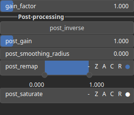

Mixer Node
==========

The Mixer operator takes several input heightmaps and blend them according to a mixing parameter expected in [0, 1].

# Category

Operator/Blend
# Inputs

|Name|Type|Description|
| :--- | :--- | :--- |
|input 1|Heightmap|Input heightmap.|
|input 2|Heightmap|Input heightmap.|
|input 3|Heightmap|Input heightmap.|
|input 4|Heightmap|Input heightmap.|
|t|Heightmap|Mixing parameter, expected in [0, 1].|

# Outputs

|Name|Type|Description|
| :--- | :--- | :--- |
|output|Heightmap|Output heightmap.|

# Example

