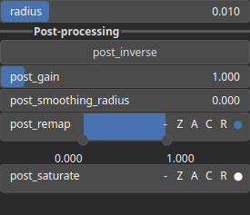

MorphologicalGradient Node
==========================

MorphologicalGradient calculates the difference between dilation and erosion of an image, resulting in the outline of objects. Use Cases: Edge detection, boundary extraction.

# Category

Operator/Morphology
# Inputs

|Name|Type|Description|
| :--- | :--- | :--- |
|input|Heightmap|Input heightmap.|

# Outputs

|Name|Type|Description|
| :--- | :--- | :--- |
|output|Heightmap|Gradient heightmap.|

# Parameters

|Name|Type|Description|
| :--- | :--- | :--- |
|GPU|Bool|Toogle GPU acceleration on or off.|
|inverse|Bool|Toggle inversion of the output values.|
|radius|Float|Filter radius with respect to the domain size.|
|remap|Value range|Remap the operator's output to a specified range, defaulting to [0, 1].|

# Example

