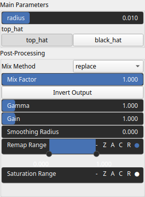

MorphologicalTopHat Node
========================

Applies a morphological operator to detect ridges (top hat) or valleys (black hat) in a Digital Elevation Model (DEM).

# Category

Operator/Morphology
# Inputs

|Name|Type|Description|
| :--- | :--- | :--- |
|input|Heightmap|Input heightmap.|

# Outputs

|Name|Type|Description|
| :--- | :--- | :--- |
|output|Heightmap|Output heightmap.|

# Parameters

|Name|Type|Description|
| :--- | :--- | :--- |
|GPU|Bool|Toogle GPU acceleration on or off.|
|inverse|Bool|Toggle inversion of the output values.|
|radius|Float|Filter radius with respect to the domain size.|
|remap|Value range|Remaps the operator's output values to a specified range, defaulting to [0, 1].|
|top_hat|Bool|Toggle between top hat (ridge detection) and black hat (valley detection) morphological operator.|

# Example

No example available.