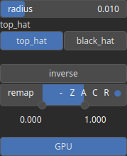

MorphologicalTopHat Node
========================

Applies a morphological operator to detect ridges (top hat) or valleys (black hat) in a Digital Elevation Model (DEM).

# Category

Operator/Morphology
# Inputs

|Name|Type|Description|
| :--- | :--- | :--- |
|input|Heightmap|Input heightmap.|

# Outputs

|Name|Type|Description|
| :--- | :--- | :--- |
|output|Heightmap|Output heightmap.|

# Parameters

|Name|Type|Description|
| :--- | :--- | :--- |
|post_gain|Float|No description|
|post_inverse|Bool|No description|
|post_remap|Value range|No description|
|post_saturate|Value range|No description|
|post_smoothing_radius|Float|No description|
|radius|Float|Filter radius with respect to the domain size.|
|top_hat|Bool|Toggle between top hat (ridge detection) and black hat (valley detection) morphological operator.|

# Example

No example available.