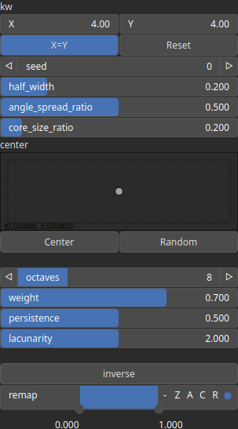

MountainRangeRadial Node
========================

Generates a heightmap representing a radial mountain range emanating from a specified center.

# Category

Primitive/Geological
# Inputs

|Name|Type|Description|
| :--- | :--- | :--- |
|control|Heightmap|Optional input that modulates the terrain shape and noise distribution.|
|dx|Heightmap|Optional input for perturbing the terrain in the X-direction.|
|dy|Heightmap|Optional input for perturbing the terrain in the Y-direction.|
|envelope|Heightmap|Modulates the amplitude of the mountain range across the heightmap.|

# Outputs

|Name|Type|Description|
| :--- | :--- | :--- |
|angle|Heightmap|Optional output providing the computed angle values for terrain features.|
|output|Heightmap|The final heightmap representing the radial mountain range.|

# Parameters

|Name|Type|Description|
| :--- | :--- | :--- |
|angle_spread_ratio|Float|Controls the angular spread of the mountain range. Lower values create more concentrated ridges, while higher values distribute them more evenly.|
|center|Vec2Float|The center point of the radial mountain range as normalized coordinates within [0, 1].|
|core_size_ratio|Float|Determines the relative size of the core mountain region before tapering begins.|
|half_width|Float|Defines the half-width of the radial mountain range, controlling its spread.|
|inverse|Bool|Toggle inversion of the output values, flipping elevations.|
|kw|Wavenumber|The wave numbers (frequency components) that define the base frequency of the noise function.|
|lacunarity|Float|The frequency scaling factor for successive noise octaves. Higher values increase the frequency of each successive octave.|
|octaves|Integer|The number of octaves for fractal noise generation. More octaves add finer details to the terrain.|
|persistence|Float|The amplitude scaling factor for subsequent noise octaves. Lower values reduce the contribution of higher octaves.|
|remap|Value range|Remaps the operator's output values to a specified range, defaulting to [0, 1].|
|seed|Random seed number|Sets the seed for random noise generation, ensuring reproducibility.|
|weight|Float|Initial weight for noise contribution. Higher values amplify the primary terrain features.|

# Example

No example available.