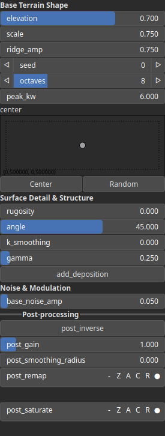

MountainStump Node
==================

No description available

# Category

Primitive/Geological
# Inputs

|Name|Type|Description|
| :--- | :--- | :--- |
|dx|Heightmap|No description|
|dy|Heightmap|No description|
|envelope|Heightmap|No description|

# Outputs

|Name|Type|Description|
| :--- | :--- | :--- |
|out|Heightmap|No description|

# Parameters

|Name|Type|Description|
| :--- | :--- | :--- |
|add_deposition|Bool|No description|
|angle|Float|No description|
|base_noise_amp|Float|No description|
|center|Vec2Float|No description|
|elevation|Float|No description|
|gamma|Float|No description|
|k_smoothing|Float|No description|
|octaves|Integer|No description|
|peak_kw|Float|No description|
|post_gain|Float|No description|
|post_inverse|Bool|No description|
|post_remap|Value range|No description|
|post_smoothing_radius|Float|No description|
|ridge_amp|Float|No description|
|rugosity|Float|No description|
|scale|Float|No description|
|seed|Random seed number|No description|

# Example

No example available.