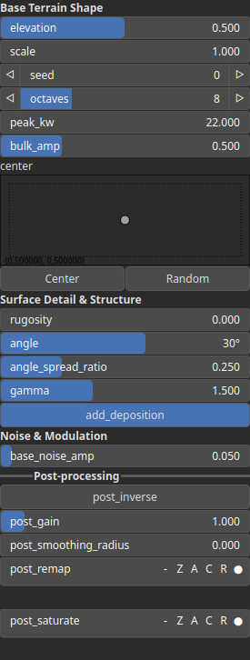

MountainTibesti Node
====================

No description available

# Category

Primitive/Geological
# Inputs

|Name|Type|Description|
| :--- | :--- | :--- |
|dx|Heightmap|No description|
|dy|Heightmap|No description|
|envelope|Heightmap|No description|

# Outputs

|Name|Type|Description|
| :--- | :--- | :--- |
|out|Heightmap|No description|

# Parameters

|Name|Type|Description|
| :--- | :--- | :--- |
|add_deposition|Bool|No description|
|angle|Float|No description|
|angle_spread_ratio|Float|No description|
|base_noise_amp|Float|No description|
|bulk_amp|Float|No description|
|center|Vec2Float|No description|
|elevation|Float|No description|
|gamma|Float|No description|
|octaves|Integer|No description|
|peak_kw|Float|No description|
|post_gain|Float|Set the gain. Gain is a power law transformation altering the distribution of signal values, compressing or expanding certain regions of the signal depending on the exponent of the power law.|
|post_inverse|Bool|Inverts the output values after processing, flipping low and high values across the midrange.|
|post_remap|Value range|Linearly remaps the output values to a specified target range (default is [0, 1]).|
|post_saturate|Value range|Modifies the amplitude of elevations by first clamping them to a given interval and then scaling them so that the restricted interval matches the original input range. This enhances contrast in elevation variations while maintaining overall structure.|
|post_smoothing_radius|Float|Defines the radius for post-processing smoothing, determining the size of the neighborhood used to average local values and reduce high-frequency detail. A radius of 0 disables smoothing.|
|rugosity|Float|No description|
|scale|Float|No description|
|seed|Random seed number|No description|

# Example

No example available.