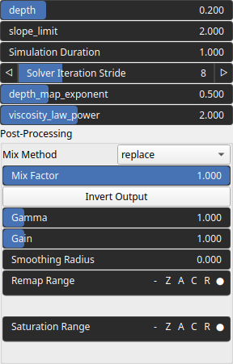

Mudslide Node
=============

No description available

# Category

WIP
# Inputs

|Name|Type|Description|
| :--- | :--- | :--- |
|input|VirtualArray|No description|
|landslide_mask|VirtualArray|No description|

# Outputs

|Name|Type|Description|
| :--- | :--- | :--- |
|depth|VirtualArray|No description|
|output|VirtualArray|No description|

# Parameters

|Name|Type|Description|
| :--- | :--- | :--- |
|depth|Float|No description|
|depth_map_exponent|Float|No description|
|Simulation Duration|Float|No description|
|Gain|Float|No description|
|Gamma|Float|No description|
|Invert Output|Bool|No description|
|Mix Factor|Float|No description|
|Mix Method|Enumeration|No description|
|Remap Range|Value range|No description|
|Saturation Range|Value range|No description|
|Smoothing Radius|Float|No description|
|slope_limit|Float|No description|
|Solver Iteration Stride|Integer|No description|
|viscosity_law_power|Float|No description|

# Example

No example available.