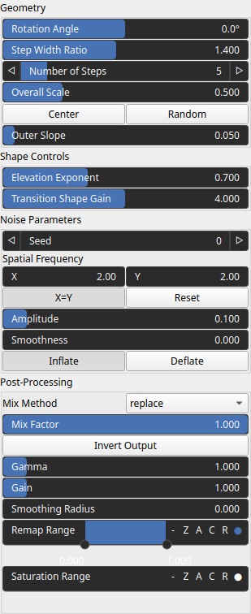

Multisteps Node
===============

Generates a multi-step height profile along a rotated axis, optionally modulated by control and noise fields.

# Category

Primitive/Geological
# Inputs

|Name|Type|Description|
| :--- | :--- | :--- |
|control|Heightmap|Optional control field used to modulate step height or shape along the axis.|
|dx|Heightmap|Displacement with respect to the domain size (x-direction).|
|dy|Heightmap|Displacement with respect to the domain size (y-direction).|
|envelope|Heightmap|Heightmap used as a post-process amplitude multiplier for the generated noise.|

# Outputs

|Name|Type|Description|
| :--- | :--- | :--- |
|output|Heightmap|Resulting heightmap containing the generated multi-step profile after optional modulation and post-processing.|

# Parameters

|Name|Type|Description|
| :--- | :--- | :--- |
|Rotation Angle|Float|Rotation angle (in degrees) that orients the step axis within the domain.|
|Center|Vec2Float|2D center point of the rotated step axis, expressed in normalized domain coordinates.|
|Elevation Exponent|Float|Exponent controlling the vertical shaping of each step. Values greater than 1 sharpen heights, while values below 1 soften them.|
|Spatial Frequency|Wavenumber|Base spatial frequencies in the X and Y directions. The frequencies are defined with respect to the entire domain: for example, kw = 2 produces two full oscillations across the domain width (and similarly for the Y direction).|
|Amplitude|Float|Amplitude of the noise modulation applied along the step axis. Higher values increase deformation intensity.|
||Bool|Controls how noise affects the step profile. ‘Inflate’ pushes elevations outward, while ‘Deflate’ pulls them inward.|
|Smoothness|Float|Smoothness of the noise field. Lower values produce rougher, high-frequency variations; higher values smooth the noise.|
|Number of Steps|Integer|Total number of geometric steps composing the profile.|
|Outer Slope|Float|Slope of the function outside the normalized [0, 1] axis range, defining how values behave beyond the step region.|
|Gain|Float|Set the gain. Gain is a power law transformation altering the distribution of signal values, compressing or expanding certain regions of the signal depending on the exponent of the power law.|
|Gamma|Float|No description|
|Invert Output|Bool|Inverts the output values after processing, flipping low and high values across the midrange.|
|Remap Range|Value range|Linearly remaps the output values to a specified target range (default is [0, 1]).|
|Saturation Range|Value range|Modifies the amplitude of elevations by first clamping them to a given interval and then scaling them so that the restricted interval matches the original input range. This enhances contrast in elevation variations while maintaining overall structure.|
|Smoothing Radius|Float|Defines the radius for post-processing smoothing, determining the size of the neighborhood used to average local values and reduce high-frequency detail. A radius of 0 disables smoothing.|
|Step Width Ratio|Float|Geometric ratio between successive step widths. Values above 1 create increasingly wide steps.|
|Overall Scale|Float|Overall scale of the step axis, determining the spatial expansion of the stepped pattern.|
|Seed|Random seed number|Random seed number. The random seed is an offset to the randomized process. A different seed will produce a new result.|
|Transition Shape Gain|Float|Gain controlling the sharpness of transitions within each step. Higher values produce steeper intra-step transitions.|

# Example

No example available.