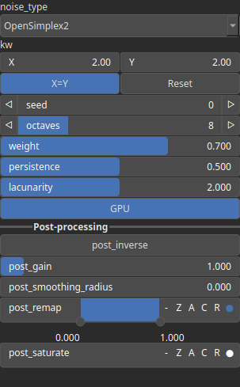

NoiseFbm Node
=============

Fractal noise is a mathematical algorithm used to generate complex and detailed patterns characterized by self-similarity across different scales.

# Category

Primitive/Coherent
# Inputs

|Name|Type|Description|
| :--- | :--- | :--- |
|control|Heightmap|Control parameter, acts as a multiplier for the weight parameter.|
|dx|Heightmap|Displacement with respect to the domain size (x-direction).|
|dy|Heightmap|Displacement with respect to the domain size (y-direction).|
|envelope|Heightmap|Output noise amplitude envelope.|

# Outputs

|Name|Type|Description|
| :--- | :--- | :--- |
|output|Heightmap|Generated noise.|

# Parameters

|Name|Type|Description|
| :--- | :--- | :--- |
|GPU|Bool|Toogle GPU acceleration on or off.|
|kw|Wavenumber|Noise wavenumbers (kx, ky) for each directions.|
|lacunarity|Float|Wavenumber ratio between each octaves.|
|noise_type|Enumeration|Base primitive noise. Available values: OpenSimplex2, OpenSimplex2S, Perlin, Perlin (billow), Perlin (half), Value, Value (cubic), Worley, Worley (doube), Worley (value).|
|octaves|Integer|Number of octaves.|
|persistence|Float|Octave persistence.|
|post_gain|Float|Set the gain. Gain is a power law transformation altering the distribution of signal values, compressing or expanding certain regions of the signal depending on the exponent of the power law.|
|post_inverse|Bool|Inverts the output values after processing, flipping low and high values across the midrange.|
|post_remap|Value range|Linearly remaps the output values to a specified target range (default is [0, 1]).|
|post_smoothing_radius|Float|Defines the radius for post-processing smoothing, determining the size of the neighborhood used to average local values and reduce high-frequency detail. A radius of 0 disables smoothing.|
|seed|Random seed number|Random seed number.|
|weight|Float|Octave weighting.|

# Example

