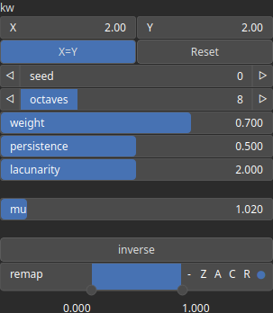

NoiseParberry Node
==================

NoiseParberry, variant of NoiseFbm, is a Perlin noise based terrain generator from Ian Parberry, Tobler's First Law of Geography, Self Similarity, and Perlin Noise: A Large Scale Analysis of Gradient Distribution in Southern Utah with Application to Procedural Terrain Generation.

# Category

Primitive/Coherent
# Inputs

|Name|Type|Description|
| :--- | :--- | :--- |
|control|Heightmap|Control parameter, acts as a multiplier for the weight parameter.|
|dx|Heightmap|Displacement with respect to the domain size (x-direction).|
|dy|Heightmap|Displacement with respect to the domain size (y-direction).|
|envelope|Heightmap|Output noise amplitude envelope.|

# Outputs

|Name|Type|Description|
| :--- | :--- | :--- |
|output|Heightmap|Generated noise.|

# Parameters

|Name|Type|Description|
| :--- | :--- | :--- |
|inverse|Bool|Toggle inversion of the output values.|
|kw|Wavenumber|Noise wavenumbers (kx, ky) for each directions.|
|lacunarity|Float|Wavenumber ratio between each octaves.|
|mu|Float|Gradient magnitude exponent.|
|octaves|Integer|Number of octaves.|
|persistence|Float|Octave persistence.|
|remap|Value range|Remap the operator's output to a specified range, defaulting to [0, 1].|
|seed|Random seed number|Random seed number.|
|weight|Float|Octave weighting.|

# Example

