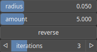

NormalDisplacement Node
=======================

NormalDisplacement applies a displacement to the terrain along the normal direction.

# Category

Filter/Recast
# Inputs

|Name|Type|Description|
| :--- | :--- | :--- |
|input|Heightmap|Input heightmap.|
|mask|Heightmap|Mask defining the filtering intensity (expected in [0, 1]).|

# Outputs

|Name|Type|Description|
| :--- | :--- | :--- |
|output|Heightmap|Output heightmap.|

# Parameters

|Name|Type|Description|
| :--- | :--- | :--- |
|GPU|Bool|Toogle GPU acceleration on or off.|
|amount|Float|Displacement scaling.|
|iterations|Integer|Number of successive use of the operator.|
|radius|Float|Filter radius with respect to the domain size.|
|reverse|Bool|Reverse displacement direction.|

# Example

