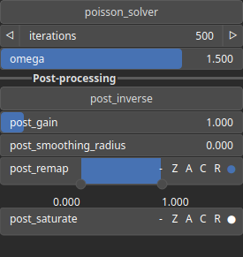
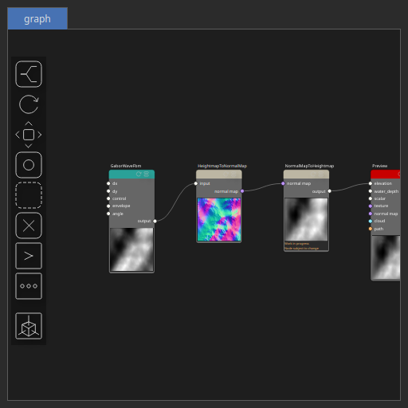

NormalMapToHeightmap Node
=========================

No description available

# Category

Converter
# Inputs

|Name|Type|Description|
| :--- | :--- | :--- |
|normal map|HeightmapRGBA|No description|

# Outputs

|Name|Type|Description|
| :--- | :--- | :--- |
|output|Heightmap|No description|

# Parameters

|Name|Type|Description|
| :--- | :--- | :--- |
|iterations|Integer|No description|
|omega|Float|No description|
|poisson_solver|Bool|No description|
|post_gain|Float|No description|
|post_inverse|Bool|No description|
|post_remap|Value range|No description|
|post_smoothing_radius|Float|No description|

# Example

Corresponding Hesiod file: [NormalMapToHeightmap.hsd](../../examples/NormalMapToHeightmap.hsd). Use [Ctrl+I] in the node editor to import a hsd file within your current project. 

> **Note:** Example files are kept up-to-date with the latest version of [Hesiod](https://github.com/otto-link/Hesiod).
> If you find an error, please [open an issue](https://github.com/otto-link/Hesiod/issues).

