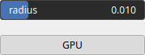

Opening Node
============

Opening is a combination of erosion followed by dilation. It is primarily used for removing noise while preserving the shape and size of objects. Use Cases: Noise removal: Opening is effective in removing small, isolated noise regions while keeping the main objects intact. Smoothing object boundaries: Opening can help smooth the boundaries of objects in an image while preserving their overall shape.

# Category

Operator/Morphology
# Inputs

|Name|Type|Description|
| :--- | :--- | :--- |
|input|Heightmap|Input heightmap.|

# Outputs

|Name|Type|Description|
| :--- | :--- | :--- |
|output|Heightmap|Dilated heightmap.|

# Parameters

|Name|Type|Description|
| :--- | :--- | :--- |
|GPU|Bool|Toogle GPU acceleration on or off.|
|radius|Float|Filter radius with respect to the domain size.|

# Example

