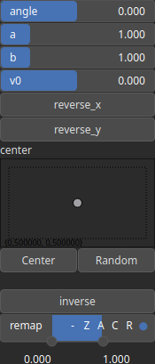

Paraboloid Node
===============

.

# Category

Primitive/Function
# Inputs

|Name|Type|Description|
| :--- | :--- | :--- |
|dx|Heightmap|Displacement with respect to the domain size (x-direction).|
|dy|Heightmap|Displacement with respect to the domain size (y-direction).|
|envelope|Heightmap|Heightmap used as a post-process amplitude multiplier for the generated noise.|

# Outputs

|Name|Type|Description|
| :--- | :--- | :--- |
|output|Heightmap|Paraboloid.|

# Parameters

|Name|Type|Description|
| :--- | :--- | :--- |
|a|Float|Curvature parameter, first principal axis.|
|angle|Float|Angle.|
|b|Float|Curvature parameter, second principal axis.|
|center|Vec2Float|Reference center within the heightmap.|
|inverse|Bool|Toggle inversion of the output values.|
|remap|Value range|Remap the operator's output to a specified range, defaulting to [0, 1].|
|reverse_x|Bool|Reverse coefficient of first principal axis.|
|reverse_y|Bool|Reverse coefficient of second principal axis.|
|v0|Float|Value at the paraboloid center.|

# Example

No example available.