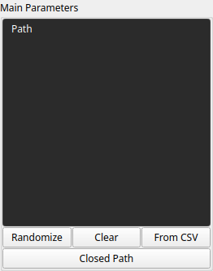

Path Node
=========

A polyline defined by a series of connected points (x, y) with elevation data (z). Paths can represent linear features such as roads, rivers, or boundaries.

## Category

Geometry/Path
## Inputs

|Name|Type|Description|
| :--- | :--- | :--- |
|background|VirtualArray|No description|

## Outputs

|Name|Type|Description|
| :--- | :--- | :--- |
|path|Path|Outputs the path as a set of directed points (x, y) and elevations (z).|

## Parameters

|Name|Type|Description|
| :--- | :--- | :--- |
|Closed Path|Bool|No description|
|Path|Path|The sequence of points defining the path. Each point consists of coordinates (x, y) and an elevation (z).|

## Example

Corresponding Hesiod file: [Path.hsd](../../examples/Path.hsd). Use [Ctrl+I] in the node editor to import a hsd file within your current project.

!!! note
    Example files are kept up-to-date with the latest version of [Hesiod](https://github.com/otto-link/Hesiod).
    If you find an error, please [open an issue](https://github.com/otto-link/Hesiod/issues).

