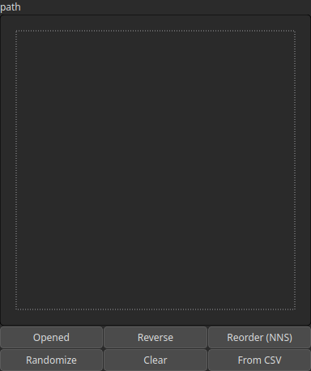

Path Node
=========

A polyline defined by a series of connected points (x, y) with elevation data (z). Paths can represent linear features such as roads, rivers, or boundaries.

# Category

Geometry/Path
# Outputs

|Name|Type|Description|
| :--- | :--- | :--- |
|path|Path|Outputs the path as a set of directed points (x, y) and elevations (z).|

# Parameters

|Name|Type|Description|
| :--- | :--- | :--- |
|path|Path|The sequence of points defining the path. Each point consists of coordinates (x, y) and an elevation (z).|

# Example

No example available.