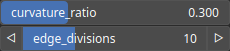

PathBezier Node
===============

PathBezier uses Bezier interpolation to replace sharp angles and straight segments with smooth, flowing curves.

# Category

Geometry/Path
# Inputs

|Name|Type|Description|
| :--- | :--- | :--- |
|input|Path|Input path.|

# Outputs

|Name|Type|Description|
| :--- | :--- | :--- |
|output|Path|Output path.|

# Parameters

|Name|Type|Description|
| :--- | :--- | :--- |
|curvature_ratio|Float|Amount of curvature (usually in [-1, 1] and commonly > 0).|
|edge_divisions|Integer|Edge sub-divisions of each edge. After the operation, the path is remeshed based on this new sub-division.|

# Example

No example available.