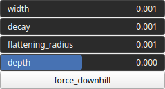

PathDig Node
============

TODO

# Category

Geometry/Path
# Inputs

|Name|Type|Description|
| :--- | :--- | :--- |
|input|Heightmap|TODO|
|path|Path|TODO|

# Outputs

|Name|Type|Description|
| :--- | :--- | :--- |
|output|Heightmap|TODO|

# Parameters

|Name|Type|Description|
| :--- | :--- | :--- |
|decay|Float|TODO|
|depth|Float|TODO|
|flattening_radius|Float|TODO|
|force_downhill|Bool|TODO|
|width|Float|TODO|

# Example

