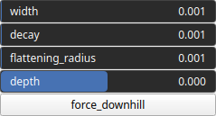

PathDig Node
============

TODO

## Category

Geometry/Path
## Inputs

|Name|Type|Description|
| :--- | :--- | :--- |
|input|VirtualArray|TODO|
|path|Path|TODO|

## Outputs

|Name|Type|Description|
| :--- | :--- | :--- |
|output|VirtualArray|TODO|

## Parameters

|Name|Type|Description|
| :--- | :--- | :--- |
|decay|Float|TODO|
|depth|Float|TODO|
|flattening_radius|Float|TODO|
|force_downhill|Bool|TODO|
|width|Float|TODO|

## Example

Corresponding Hesiod file: [PathDig.hsd](../../examples/PathDig.hsd). Use [Ctrl+I] in the node editor to import a hsd file within your current project.

!!! note
    Example files are kept up-to-date with the latest version of [Hesiod](https://github.com/otto-link/Hesiod).
    If you find an error, please [open an issue](https://github.com/otto-link/Hesiod/issues).

