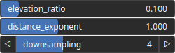

PathFind Node
=============

TODO

# Category

Geometry/Path
# Inputs

|Name|Type|Description|
| :--- | :--- | :--- |
|heightmap|VirtualArray|TODO|
|mask nogo|VirtualArray|TODO|
|waypoints|Path|TODO|

# Outputs

|Name|Type|Description|
| :--- | :--- | :--- |
|path|Path|TODO|

# Parameters

|Name|Type|Description|
| :--- | :--- | :--- |
|distance_exponent|Float|TODO|
|downsampling|Integer|TODO|
|elevation_ratio|Float|TODO|

# Example

No example available.