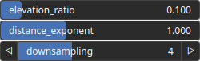

PathFind Node
=============

TODO

## Category

Geometry/Path
## Inputs

|Name|Type|Description|
| :--- | :--- | :--- |
|heightmap|VirtualArray|TODO|
|mask nogo|VirtualArray|TODO|
|waypoints|Path|TODO|

## Outputs

|Name|Type|Description|
| :--- | :--- | :--- |
|path|Path|TODO|

## Parameters

|Name|Type|Description|
| :--- | :--- | :--- |
|distance_exponent|Float|TODO|
|downsampling|Integer|TODO|
|elevation_ratio|Float|TODO|

## Example

Corresponding Hesiod file: [PathFind.hsd](../../examples/PathFind.hsd). Use [Ctrl+I] in the node editor to import a hsd file within your current project.

!!! note
    Example files are kept up-to-date with the latest version of [Hesiod](https://github.com/otto-link/Hesiod).
    If you find an error, please [open an issue](https://github.com/otto-link/Hesiod/issues).

