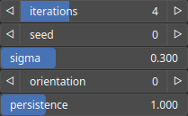

PathFractalize Node
===================

PathFractalize fractalizes a polyline using a mid-point displacement algorithm. The procedure involves iteratively modifying the polyline's geometry to increase its complexity, mimicking fractal characteristics.

# Category

Geometry/Path
# Inputs

|Name|Type|Description|
| :--- | :--- | :--- |
|input|Path|Input path.|

# Outputs

|Name|Type|Description|
| :--- | :--- | :--- |
|output|Path|Output path.|

# Parameters

|Name|Type|Description|
| :--- | :--- | :--- |
|iterations|Integer|Number of mid-point displacement iterations.|
|orientation|Integer|Displacement orientation (0 for random inward/outward displacement, 1 to inflate the path and -1 to deflate the path).|
|persistence|Float|The amplitude scaling factor for subsequent noise octaves. Lower values reduce the contribution of higher octaves.|
|Seed|Random seed number|Random seed number. The random seed is an offset to the randomized process. A different seed will produce a new result.|
|sigma|Float|Half-width of the random Gaussian displacement, normalized by the distance between points.|

# Example

Corresponding Hesiod file: [PathFractalize.hsd](../../examples/PathFractalize.hsd). Use [Ctrl+I] in the node editor to import a hsd file within your current project. 

> **Note:** Example files are kept up-to-date with the latest version of [Hesiod](https://github.com/otto-link/Hesiod).
> If you find an error, please [open an issue](https://github.com/otto-link/Hesiod/issues).

