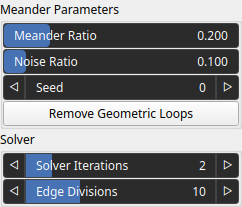

PathMeanderize Node
===================

PathMeanderize uses Bezier interpolation to add menaders to the input path.

## Category

Geometry/Path
## Inputs

|Name|Type|Description|
| :--- | :--- | :--- |
|input|Path|Input path.|

## Outputs

|Name|Type|Description|
| :--- | :--- | :--- |
|output|Path|Output path.|

## Parameters

|Name|Type|Description|
| :--- | :--- | :--- |
|Edge Divisions|Integer|Edge sub-divisions of each edge. After the operation, the path is remeshed based on this new sub-division.|
|Solver Iterations|Integer|Number of meandering iterations.|
|Noise Ratio|Float|Randomness ratio.|
|Meander Ratio|Float|Meander amplitude ratio.|
|Remove Geometric Loops|Bool|No description|
|Seed|Random seed number|Random seed number. The random seed is an offset to the randomized process. A different seed will produce a new result.|

## Example

Corresponding Hesiod file: [PathMeanderize.hsd](../../examples/PathMeanderize.hsd). Use [Ctrl+I] in the node editor to import a hsd file within your current project.

!!! note
    Example files are kept up-to-date with the latest version of [Hesiod](https://github.com/otto-link/Hesiod).
    If you find an error, please [open an issue](https://github.com/otto-link/Hesiod/issues).

