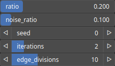

PathMeanderize Node
===================

PathMeanderize uses Bezier interpolation to add menaders to the input path.

# Category

Geometry/Path
# Inputs

|Name|Type|Description|
| :--- | :--- | :--- |
|input|Path|Input path.|

# Outputs

|Name|Type|Description|
| :--- | :--- | :--- |
|output|Path|Output path.|

# Parameters

|Name|Type|Description|
| :--- | :--- | :--- |
|edge_divisions|Integer|Edge sub-divisions of each edge. After the operation, the path is remeshed based on this new sub-division.|
|iterations|Integer|Number of meandering iterations.|
|noise_ratio|Float|Randomness ratio.|
|ratio|Float|Meander amplitude ratio.|
|seed|Random seed number|Random seed number|

# Example

