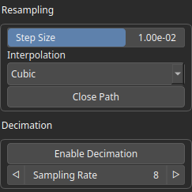

PathResample Node
=================

PathResample resamples the path based to get (approximately) a given distance between points.

# Category

Geometry/Path
# Inputs

|Name|Type|Description|
| :--- | :--- | :--- |
|input|Path|Input path.|

# Outputs

|Name|Type|Description|
| :--- | :--- | :--- |
|path|Path|No description|

# Parameters

|Name|Type|Description|
| :--- | :--- | :--- |
|Close Path|Bool|No description|
|Sampling Rate|Integer|No description|
|Step Size|Float|Target distance between the points.|
|Enable Decimation|Bool|No description|
|Interpolation|Choice|No description|

# Example

No example available.  
