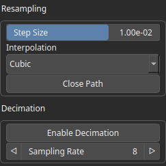

PathResample Node
=================

PathResample resamples the path based to get (approximately) a given distance between points.

## Category

Geometry/Path
## Inputs

|Name|Type|Description|
| :--- | :--- | :--- |
|input|Path|Input path.|

## Outputs

|Name|Type|Description|
| :--- | :--- | :--- |
|path|Path|No description|

## Parameters

|Name|Type|Description|
| :--- | :--- | :--- |
|Close Path|Bool|No description|
|Sampling Rate|Integer|No description|
|Step Size|Float|Target distance between the points.|
|Enable Decimation|Bool|No description|
|Interpolation|Choice|No description|

## Example

Corresponding Hesiod file: [PathResample.hsd](../../examples/PathResample.hsd). Use [Ctrl+I] in the node editor to import a hsd file within your current project.

!!! note
    Example files are kept up-to-date with the latest version of [Hesiod](https://github.com/otto-link/Hesiod).
    If you find an error, please [open an issue](https://github.com/otto-link/Hesiod/issues).

