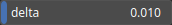

PathResample Node
=================

PathResample resamples the path based to get (approximately) a given distance between points.

# Category

Geometry/Path
# Inputs

|Name|Type|Description|
| :--- | :--- | :--- |
|input|Path|Input path.|

# Outputs

|Name|Type|Description|
| :--- | :--- | :--- |
|output|Path|Output path.|

# Parameters

|Name|Type|Description|
| :--- | :--- | :--- |
|delta|Float|Target distance between the points.|

# Example

