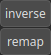

PathSDF Node
============

PathSDF evaluates the signed distance function of a polyline. It assigns a signed distance value to every point in space. For points outside the polyline, the distance is positive, while for points inside, it's negative. The zero level set of this function precisely defines the polyline's path Project path points to an heightmap.

# Category

Geometry/Path
# Inputs

|Name|Type|Description|
| :--- | :--- | :--- |
|dx|Heightmap|TODO|
|dy|Heightmap|TODO|
|path|Path|Input path.|

# Outputs

|Name|Type|Description|
| :--- | :--- | :--- |
|sdf|Heightmap|Signed distance as an heightmap.|

# Parameters

|Name|Type|Description|
| :--- | :--- | :--- |
|inverse|Bool|Toggle inversion of the output values.|
|remap|Bool|Remap the operator's output to a specified range, defaulting to [0, 1].|

# Example

