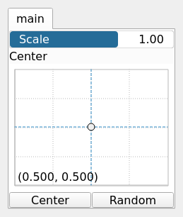

PathScale Node
==============

PathScale scales the coordinates of the points in a path relative to a specified center point.

## Category

Geometry/Path
## Inputs

|Name|Type|Description|
| :--- | :--- | :--- |
|input|Path|Input path.|

## Outputs

|Name|Type|Description|
| :--- | :--- | :--- |
|output|Path|Output scaled path.|

## Parameters

|Name|Type|Description|
| :--- | :--- | :--- |
|Center|Vec2Float|Center of scaling.|
|Scale|Float|Scale factor.|

## Example

!!! note "No example yet"
    No example available for this node.