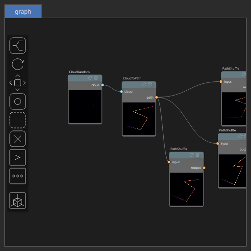

PathShuffle Node
================

No description available

# Category

Geometry/Path
# Inputs

|Name|Type|Description|
| :--- | :--- | :--- |
|input|Path|No description|

# Outputs

|Name|Type|Description|
| :--- | :--- | :--- |
|output|Path|No description|

# Parameters

|Name|Type|Description|
| :--- | :--- | :--- |
|dv|Float|No description|
|dx|Float|No description|
|dy|Float|No description|
|Seed|Random seed number|Random seed number. The random seed is an offset to the randomized process. A different seed will produce a new result.|

# Example

Corresponding Hesiod file: [PathShuffle.hsd](../../examples/PathShuffle.hsd). Use [Ctrl+I] in the node editor to import a hsd file within your current project. 

> **Note:** Example files are kept up-to-date with the latest version of [Hesiod](https://github.com/otto-link/Hesiod).
> If you find an error, please [open an issue](https://github.com/otto-link/Hesiod/issues).

