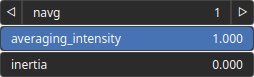

PathSmooth Node
===============

TODO

## Category

Geometry/Path
## Inputs

|Name|Type|Description|
| :--- | :--- | :--- |
|input|Path|TODO|

## Outputs

|Name|Type|Description|
| :--- | :--- | :--- |
|output|Path|TODO|

## Parameters

|Name|Type|Description|
| :--- | :--- | :--- |
|averaging_intensity|Float|TODO|
|inertia|Float|TODO|
|navg|Integer|TODO|

## Example

Corresponding Hesiod file: [PathSmooth.hsd](../../examples/PathSmooth.hsd). Use [Ctrl+I] in the node editor to import a hsd file within your current project.

!!! note
    Example files are kept up-to-date with the latest version of [Hesiod](https://github.com/otto-link/Hesiod).
    If you find an error, please [open an issue](https://github.com/otto-link/Hesiod/issues).

