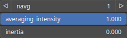

PathSmooth Node
===============

TODO

# Category

Geometry/Path
# Inputs

|Name|Type|Description|
| :--- | :--- | :--- |
|input|Path|TODO|

# Outputs

|Name|Type|Description|
| :--- | :--- | :--- |
|output|Path|TODO|

# Parameters

|Name|Type|Description|
| :--- | :--- | :--- |
|averaging_intensity|Float|TODO|
|inertia|Float|TODO|
|navg|Integer|TODO|

# Example

