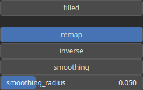

PathToHeightmap Node
====================

PathToHeightmap Project path points to an heightmap.

# Category

Geometry/Path
# Inputs

|Name|Type|Description|
| :--- | :--- | :--- |
|path|Path|Input path.|

# Outputs

|Name|Type|Description|
| :--- | :--- | :--- |
|heightmap|Heightmap|Output heightmap.|

# Parameters

|Name|Type|Description|
| :--- | :--- | :--- |
|filled|Bool|Whether the resulting path contour is filled (input Path needs to be closed).|
|inverse|Bool|Toggle inversion of the output values.|
|remap|Bool|Remap the operator's output to a specified range, defaulting to [0, 1].|
|smoothing|Bool|Enable or disable smoothing to reduce noise in the curvature computation.|
|smoothing_radius|Float|Specifies the radius for smoothing, determining how much the curvature is averaged over neighboring pixels.|

# Example

