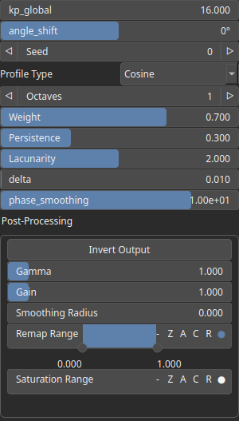

Phasor Node
===========

No description available

# Category

Primitive/Coherent
# Inputs

|Name|Type|Description|
| :--- | :--- | :--- |
|angle|VirtualArray|No description|
|noise_x|VirtualArray|No description|
|noise_y|VirtualArray|No description|

# Outputs

|Name|Type|Description|
| :--- | :--- | :--- |
|phasor_fbm|VirtualArray|No description|

# Parameters

|Name|Type|Description|
| :--- | :--- | :--- |
|angle_shift|Float|No description|
|delta|Float|No description|
|kp_global|Float|No description|
|Lacunarity|Float|No description|
|Octaves|Integer|No description|
|Persistence|Float|No description|
|phase_smoothing|Float|No description|
|Gain|Float|No description|
|Gamma|Float|No description|
|Invert Output|Bool|No description|
|Remap Range|Value range|No description|
|Saturation Range|Value range|No description|
|Smoothing Radius|Float|No description|
|Profile Type|Enumeration|No description|
|Seed|Random seed number|No description|
|Weight|Float|No description|

# Example

No example available.