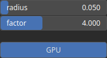

Plateau Node
============

Plateau node manipulates the elevation values to create flats, elevated regions surrounded by steep slopes.

# Category

Filter/Recurve
# Inputs

|Name|Type|Description|
| :--- | :--- | :--- |
|input|Heightmap|Input heightmap.|
|mask|Heightmap|Mask defining the filtering intensity (expected in [0, 1]).|

# Outputs

|Name|Type|Description|
| :--- | :--- | :--- |
|output|Heightmap|Filtered heightmap.|

# Parameters

|Name|Type|Description|
| :--- | :--- | :--- |
|GPU|Bool|Toogle GPU acceleration on or off.|
|factor|Float|Influence the cliff elevation profile.|
|radius|Float|Filter radius with respect to the domain size.|

# Example

No example available.