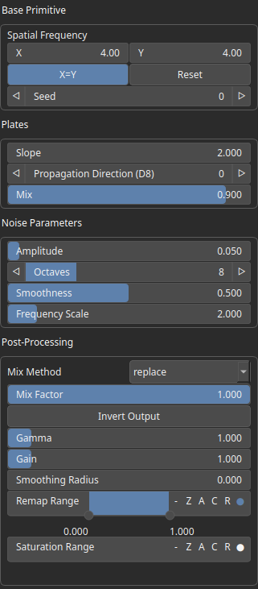

Plates Node
===========

No description available

# Category

Primitive/Geological
# Inputs

|Name|Type|Description|
| :--- | :--- | :--- |
|envelope|Heightmap|No description|

# Outputs

|Name|Type|Description|
| :--- | :--- | :--- |
|output|Heightmap|No description|

# Parameters

|Name|Type|Description|
| :--- | :--- | :--- |
|Amplitude|Float|No description|
|Propagation Direction (D8)|Integer|No description|
|Spatial Frequency|Wavenumber|No description|
|Frequency Scale|Float|No description|
|Mix|Float|No description|
|Gain|Float|No description|
|Gamma|Float|No description|
|Invert Output|Bool|No description|
|Mix Factor|Float|No description|
|Mix Method|Enumeration|No description|
|Remap Range|Value range|No description|
|Saturation Range|Value range|No description|
|Smoothing Radius|Float|No description|
|Smoothness|Float|No description|
|Seed|Random seed number|No description|
|Slope|Float|No description|

# Example

No example available.