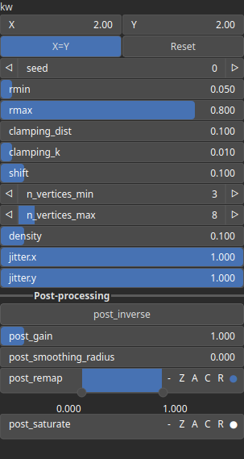

PolygonField Node
=================

No description available

# Category

Primitive/Coherent
# Inputs

|Name|Type|Description|
| :--- | :--- | :--- |
|density|Heightmap|No description|
|dr|Heightmap|No description|
|dx|Heightmap|Displacement with respect to the domain size (x-direction).|
|dy|Heightmap|Displacement with respect to the domain size (y-direction).|
|envelope|Heightmap|No description|
|size|Heightmap|No description|

# Outputs

|Name|Type|Description|
| :--- | :--- | :--- |
|output|Heightmap|No description|

# Parameters

|Name|Type|Description|
| :--- | :--- | :--- |
|clamping_dist|Float|No description|
|clamping_k|Float|No description|
|density|Float|No description|
|jitter.x|Float|No description|
|jitter.y|Float|No description|
|kw|Wavenumber|No description|
|n_vertices_max|Integer|No description|
|n_vertices_min|Integer|No description|
|post_gain|Float|Set the gain. Gain is a power law transformation altering the distribution of signal values, compressing or expanding certain regions of the signal depending on the exponent of the power law.|
|post_inverse|Bool|Inverts the output values after processing, flipping low and high values across the midrange.|
|post_remap|Value range|Linearly remaps the output values to a specified target range (default is [0, 1]).|
|post_smoothing_radius|Float|Defines the radius for post-processing smoothing, determining the size of the neighborhood used to average local values and reduce high-frequency detail. A radius of 0 disables smoothing.|
|rmax|Float|No description|
|rmin|Float|No description|
|seed|Random seed number|Random seed number.|
|shift|Float|No description|

# Example

No example available.