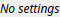

Preview Node
============

TODO

# Category

Debug
# Inputs

|Name|Type|Description|
| :--- | :--- | :--- |
|cloud|Cloud|No description|
|elevation|VirtualArray|TODO|
|normal map|VirtualTexture|TODO|
|path|Path|No description|
|scalar|VirtualArray|TODO|
|texture|VirtualTexture|TODO|
|water_depth|VirtualArray|Output water depth map representing flooded areas.|

# Example

No example available.  
