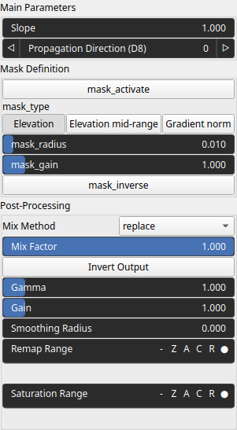

ProjectTalus Node
=================

Projects heightmap values along a discrete grid direction using talus-based attenuation. Values propagate outward following the D8 convention and decay with distance according to a talus coefficient. The operation is typically used for slope-dependent diffusion, debris flow approximation, or directional spreading effects.

# Category

Filter
# Inputs

|Name|Type|Description|
| :--- | :--- | :--- |
|input|Heightmap|Input heightmap whose values are projected along the selected direction.|
|mask|Heightmap|Optional mask controlling where the projection effect is applied.|

# Outputs

|Name|Type|Description|
| :--- | :--- | :--- |
|output|Heightmap|Resulting heightmap after directional projection and talus-based attenuation.|

# Parameters

|Name|Type|Description|
| :--- | :--- | :--- |
|Propagation Direction (D8)|Integer|Propagation direction following the D8 grid convention. Values range from 0 to 7, each corresponding to one of the eight neighboring directions on a 2D grid.|
|mask_activate|Bool|Enables masking of the projection effect using the provided mask input.|
|mask_gain|Float|Gain applied to the mask values, allowing amplification or attenuation of the mask influence.|
|mask_inverse|Bool|Inverts the mask values, swapping masked and unmasked regions.|
|mask_radius|Float|Radius used to smooth or expand the mask influence spatially.|
|mask_type|Choice|Defines how the mask is interpreted or combined with the projection effect.|
|Gain|Float|Applies a power-law gain to the output values, reshaping the distribution by compressing or expanding value ranges.|
|Invert Output|Bool|Inverts the processed output values after projection and post-processing.|
|Mix Factor|Float|Blending factor between the original input and the processed output. A value of 0 keeps the input unchanged, while 1 outputs only the processed result.|
|Mix Method|Enumeration|Method used to combine input and output values, such as linear interpolation, minimum, maximum, smooth min/max, addition, or subtraction.|
|Remap Range|Value range|Linearly remaps the output values to a target range, allowing normalization or range adjustment.|
|Saturation Range|Value range|Clamps values to a specified range and rescales them to enhance contrast while preserving the overall structure.|
|Smoothing Radius|Float|Radius used for post-processing smoothing to reduce high-frequency artifacts. A value of 0 disables smoothing.|
|Slope|Float|Talus attenuation coefficient controlling how quickly projected values decay with distance along the propagation direction. Higher values result in shorter propagation ranges.|

# Example

No example available.