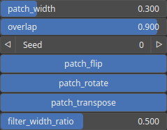

QuiltingBlend Node
==================

TODO

# Category

Operator/Resynthesis
# Inputs

|Name|Type|Description|
| :--- | :--- | :--- |
|input 1|Heightmap|TODO|
|input 2|Heightmap|TODO|
|input 3|Heightmap|TODO|
|input 4|Heightmap|TODO|

# Outputs

|Name|Type|Description|
| :--- | :--- | :--- |
|output|Heightmap|TODO|

# Parameters

|Name|Type|Description|
| :--- | :--- | :--- |
|filter_width_ratio|Float|TODO|
|overlap|Float|TODO|
|patch_flip|Bool|TODO|
|patch_rotate|Bool|TODO|
|patch_transpose|Bool|TODO|
|patch_width|Float|TODO|
|seed|Random seed number|TODO|

# Example

No example available.