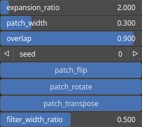

QuiltingExpand Node
===================

QuiltingExpand is an operator based on quilting that changes the feature wavenumber of a heightmap by modifying the frequency or scale of features present in the heightmap using a quilting-like technique. This operator allows for the synthesis of heightmaps with different levels of detail or spatial frequency content.

# Category

Operator/Resynthesis
# Inputs

|Name|Type|Description|
| :--- | :--- | :--- |
|input|Heightmap|Input heightmap.|

# Outputs

|Name|Type|Description|
| :--- | :--- | :--- |
|output|Heightmap|Synthetized heightmap.|

# Parameters

|Name|Type|Description|
| :--- | :--- | :--- |
|expansion_ratio|Float|Determine the features expansion ratio of the new heightmap.|
|filter_width_ratio|Float|Smooth filter width with respect the overlap length.|
|overlap|Float|Overlap ratio between patches.|
|patch_flip|Bool|Allow patch flipping.|
|patch_rotate|Bool|Allow patch 90 degree rotation.|
|patch_transpose|Bool|Allow patch tranposition.|
|patch_width|Float|Decide on the size (with respect to the domain size) of the patches that will be used to create the new heightmap. This determines the level of detail and texture in the final result.|
|seed|Random seed number|Random seed number.|

# Example

No example available.