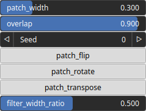

QuiltingShuffle Node
====================

QuiltingShuffle performs a quilting procedure and generates a new image by seamlessly stitching together patches from an existing image.

# Category

Operator/Resynthesis
# Inputs

|Name|Type|Description|
| :--- | :--- | :--- |
|input|Heightmap|Input heightmap.|

# Outputs

|Name|Type|Description|
| :--- | :--- | :--- |
|output|Heightmap|Synthetized heightmap.|

# Parameters

|Name|Type|Description|
| :--- | :--- | :--- |
|filter_width_ratio|Float|Smooth filter width with respect the overlap length.|
|overlap|Float|Overlap ratio between patches.|
|patch_flip|Bool|Allow patch flipping.|
|patch_rotate|Bool|Allow patch 90 degree rotation.|
|patch_transpose|Bool|Allow patch tranposition.|
|patch_width|Float|Decide on the size (with respect to the domain size) of the patches that will be used to create the new heightmap. This determines the level of detail and texture in the final result.|
|seed|Random seed number|Random seed number.|

# Example

