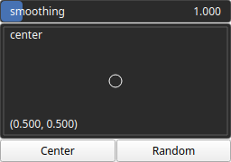

RadialDisplacementToXy Node
===========================

RadialDisplacementToXy interprets the input array dr as a radial displacement and convert it to a pair of displacements dx and dy in cartesian coordinates.

## Category

Math
## Inputs

|Name|Type|Description|
| :--- | :--- | :--- |
|dr|VirtualArray|Radial displacement.|

## Outputs

|Name|Type|Description|
| :--- | :--- | :--- |
|dx|VirtualArray|Displacement with respect to the domain size (x-direction).|
|dy|VirtualArray|Displacement with respect to the domain size (y-direction).|

## Parameters

|Name|Type|Description|
| :--- | :--- | :--- |
|center|Vec2Float|Reference center within the heightmap. Coordinates are in domain units; center.y is measured from the bottom of the map (y increases upward).|
|smoothing|Float|Smoothing parameter to avoid discontinuity at the origin.|

## Example

Corresponding Hesiod file: [RadialDisplacementToXy.hsd](../../examples/RadialDisplacementToXy.hsd). Use [Ctrl+I] in the node editor to import a hsd file within your current project.

!!! note
    Example files are kept up-to-date with the latest version of [Hesiod](https://github.com/otto-link/Hesiod).
    If you find an error, please [open an issue](https://github.com/otto-link/Hesiod/issues).

