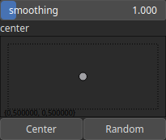

RadialDisplacementToXy Node
===========================

RadialDisplacementToXy interprets the input array dr as a radial displacement and convert it to a pair of displacements dx and dy in cartesian coordinates.

# Category

Math
# Inputs

|Name|Type|Description|
| :--- | :--- | :--- |
|dr|Heightmap|Radial displacement.|

# Outputs

|Name|Type|Description|
| :--- | :--- | :--- |
|dx|Heightmap|Displacement for  the x-direction.|
|dy|Heightmap|Displacement for  the y-direction.|

# Parameters

|Name|Type|Description|
| :--- | :--- | :--- |
|center|Vec2Float|Reference center within the heightmap.|
|smoothing|Float|Smoothing parameter to avoid discontinuity at the origin.|

# Example

No example available.