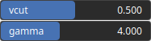

RecastCanyon Node
=================

TODO

## Category

WIP
## Inputs

|Name|Type|Description|
| :--- | :--- | :--- |
|input|VirtualArray|TODO|
|mask|VirtualArray|Mask defining the filtering intensity (expected in [0, 1]).|
|noise|VirtualArray|TODO|

## Outputs

|Name|Type|Description|
| :--- | :--- | :--- |
|output|VirtualArray|TODO|

## Parameters

|Name|Type|Description|
| :--- | :--- | :--- |
|gamma|Float|TODO|
|vcut|Float|TODO|

## Example

!!! note "No example yet"
    No example available for this node.
